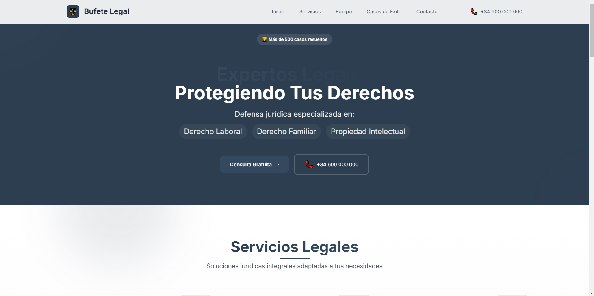

# 🏛️ Abogados landing page

## 📜 Acerca del Proyecto

Abogados Landing es una elegante y profesional página de aterrizaje diseñada para bufetes de abogados y abogados independientes. Este proyecto presenta servicios legales en una interfaz moderna y fácil de usar, ayudando a los clientes potenciales a comprender rápidamente la gama de servicios ofrecidos y a ponerse en contacto fácilmente.

🌐 [Ver Demo en Vivo](https://duandresmina.github.io/Abogados-landing/)

## ✨ Características

- 📱 Diseño totalmente responsivo para todos los tamaños de dispositivos
- 🎨 Interfaz de usuario moderna y profesional
- 🚀 Tiempos de carga rápidos con activos optimizados
- 📊 Presentación clara de servicios legales
- 📞 Información de contacto de fácil acceso
- 🔗 Integración con redes sociales

## 🛠️ Construido Con

Este proyecto aprovecha el poder de las tecnologías web modernas:

- 
- 
- 
- 
- 

